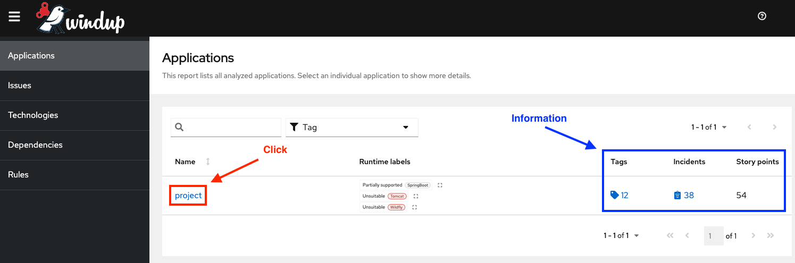
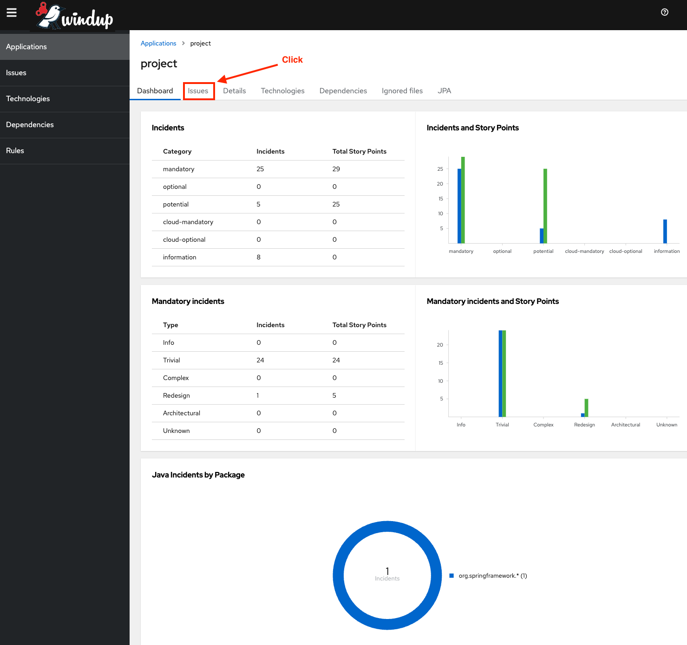
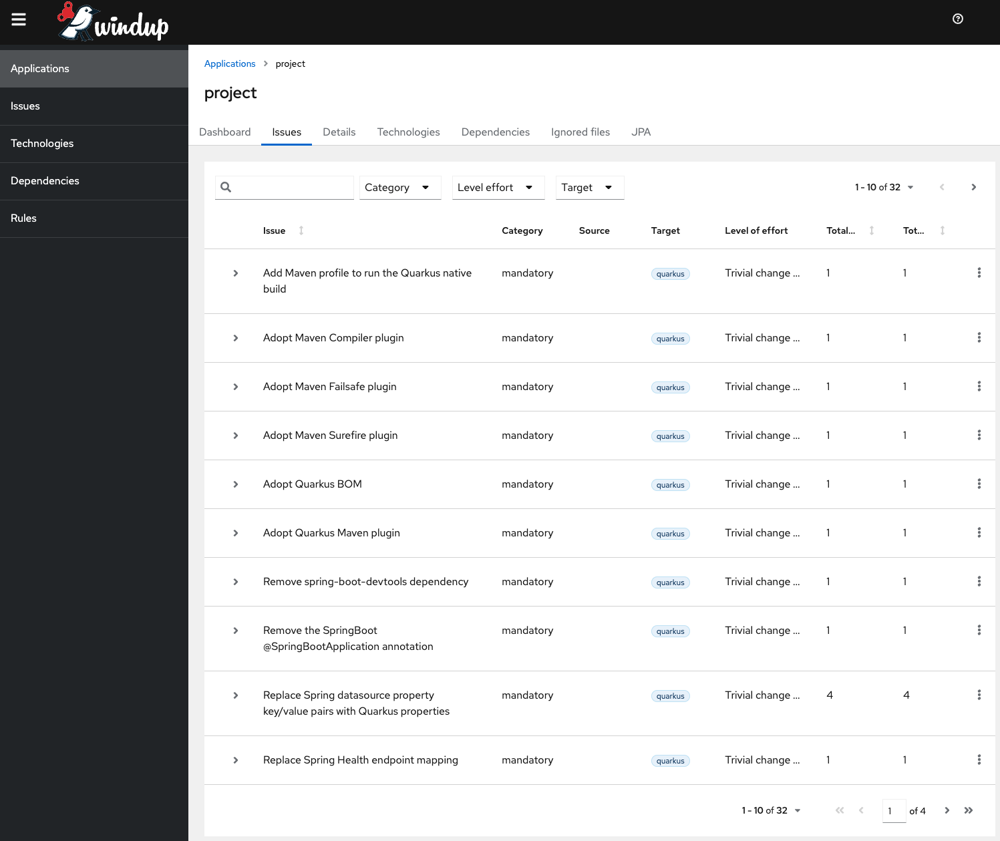
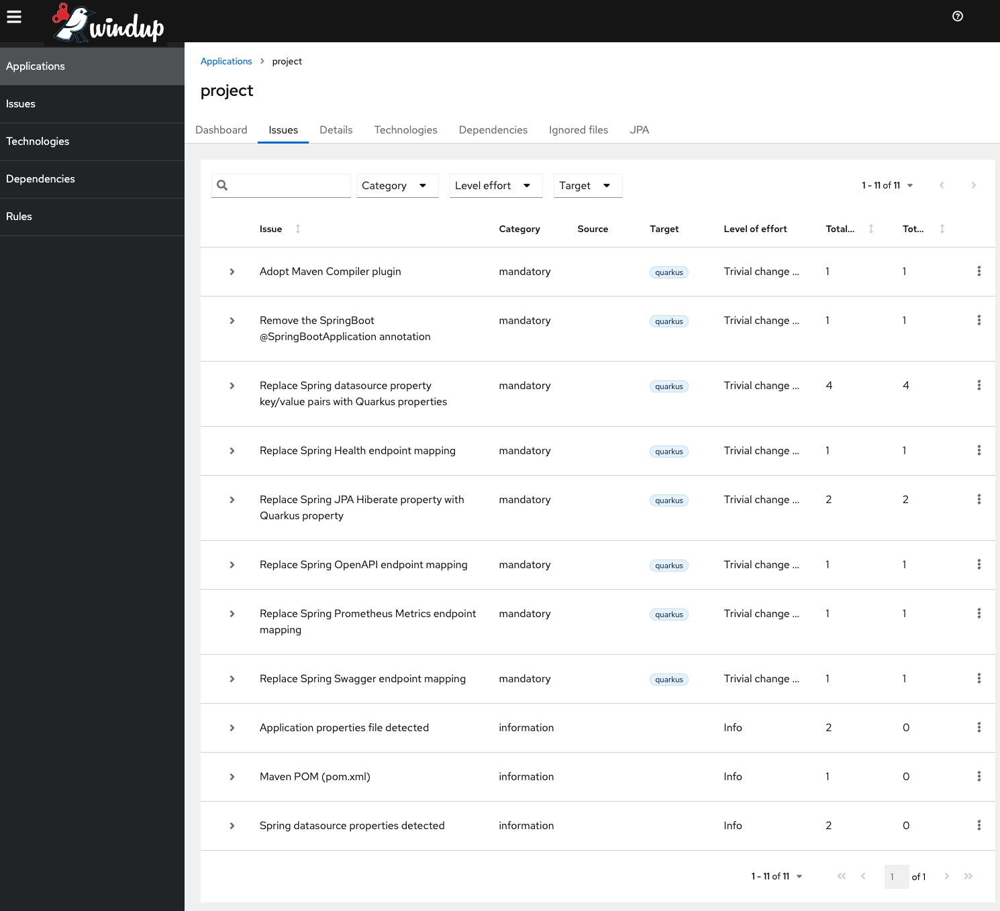

This is the solution branch containing the outcome after following the below tutorial.

---

# Table of Contents
- [Background](#background)
- [Additional Resources](#additional-resources)
- [Prerequisites](#prerequisites)
- [Run the application](#run-the-application)
- [Run the tests](#run-the-tests)
- [Examine the internals](#examine-the-internals)
- [Analyze the application for migration](#analyze-the-application-for-migration)
- [Correct Issues](#correct-issues)
- [Re-analyze the application](#re-analyze-the-application)
- [Migrate Data source properties](#migrate-data-source-properties)
- [Fix the tests](#fix-the-tests)
- [Bonus: No hassle native image](#bonus-no-hassle-native-image)

# Background
Hands-on tutorial based on a demo application that [builds and runs as either Spring Boot or Quarkus](https://developers.redhat.com/blog/2021/02/09/spring-boot-on-quarkus-magic-or-madness).

This tutorial takes a Spring Boot application using Spring MVC, Spring Data JPA, and a PostgreSQL database and converts it to Quarkus with little-to-no source code changes. It uses the [Red Hat Migration Toolkit for Applications](https://developers.redhat.com/products/mta/overview) to analyze the Spring Boot application and offer suggestions for how to migrate it to Quarkus.

The completed solution to this exercise can be found in this repo's `solution` branch.

# Additional Resources
- [Quarkus for Spring Developers eBook](https://red.ht/quarkus-spring-devs)
- [Quarkus Insights: Quarkus for Spring Developers](https://youtu.be/RvO8MUfc0kA)
- [Why should I choose Quarkus over Spring for my microservices?](https://developers.redhat.com/articles/2021/08/31/why-should-i-choose-quarkus-over-spring-my-microservices)
- [Spring Boot on Quarkus - Magic or Madness?](https://developers.redhat.com/blog/2021/02/09/spring-boot-on-quarkus-magic-or-madness)
- [Evolution of the Quarkus Developer Experience](https://dzone.com/articles/evolution-of-the-quarkus-developer-experience)
- [Red Hat Migration Toolkit for Applications](https://developers.redhat.com/products/mta/overview)

# Prerequisites
- A Java 17 runtime
- A container runtime (i.e. [Docker](https://www.docker.com/) or [Podman](https://podman.io/))
   - `docker` commands are used throughout this example
- Access to the internet

# Run the application
1. Start the required PostgreSQL database:
   ```
   docker run -it --rm --name tododb -e POSTGRES_USER=todo -e POSTGRES_PASSWORD=todo -e POSTGRES_DB=tododb -p 5432:5432 postgres:14
   ```

   > **NOTE:** If you see an error related to rate limits (something like `You have reached your pull rate limit`), you need to first do a `docker login -u <YOUR_DOCKER_USERNAME>` in order to pull the image. If you don't have a username, you can [create a free account](https://hub.docker.com/signup).

2. Run the application:
   ```shell
   ./mvnw clean spring-boot:run
   ```

   You should see the standard Spring Boot Banner:
   ```shell
     .   ____          _            __ _ _
    /\\ / ___'_ __ _ _(_)_ __  __ _ \ \ \ \
   ( ( )\___ | '_ | '_| | '_ \/ _` | \ \ \ \
    \\/  ___)| |_)| | | | | || (_| |  ) ) ) )
     '  |____| .__|_| |_|_| |_\__, | / / / /
    =========|_|==============|___/=/_/_/_/
    :: Spring Boot ::                (v3.0.5)
   
   INFO 33595 --- [  restartedMain] com.acme.todo.TodoApplication            : Started TodoApplication in 5.073 seconds (JVM running for 5.544)
   ```
3. Open your browser to http://localhost:8080. You should see

   

4. Play around with the application a bit. Type a new todo into the text box and press `Enter`. That todo will show up in the list:

   

   1. Click the empty circle next to a todo to complete it, or uncheck it to mark it as incomplete.
   2. Click the `X` to remove a todo.
   3. The `OpenAPI` link at the bottom of the page will open the OpenAPI 3.0 specification for the application.
   4. The `Swagger UI` link opens the embedded [Swagger UI](https://swagger.io/tools/swagger-ui/), which can be used to execute some of the [RESTful endpoints](https://en.wikipedia.org/wiki/Representational_state_transfer) directly.
   5. The `Prometheus Metrics` link leads to the [Prometheus metrics endpoint](https://docs.spring.io/spring-boot/docs/current/reference/html/production-ready-features.html#production-ready-metrics-export-prometheus), which would be scraped intermittently by [Prometheus](https://prometheus.io/).
   6. The `Health Check` link opens the [built-in health check](https://docs.spring.io/spring-boot/docs/current/reference/html/production-ready-features.html#production-ready-health) exposed by Spring Boot.
5. Go ahead and play around a bit to see it all in action. Use `CTRL-C` in the terminal to stop the application before proceeding.
6. Run `./mvnw clean` to clean things up.
7. **IMPORTANT!** Also make sure to stop the docker daemon running the PostgreSQL database from step 1 before proceeding (you can use `CTRL-C` to stop it).

# Run the tests
Every application should have tests! This application is no different!

Run the command `./mvnw clean verify` to run the tests. You should notice that doing this will automatically start a PostgreSQL database. The application uses the [Testcontainers Postgres Module](https://www.testcontainers.org/modules/databases/postgres/) to accomplish this.

# Examine the internals
- [Spring MVC](https://docs.spring.io/spring-framework/docs/current/reference/html/web.html) for building the REST layer:
   - Open [`src/main/java/com/acme/todo/rest/TodoController.java`](src/main/java/com/acme/todo/rest/TodoController.java) to find the Spring MVC RESTful controller, exposing the various endpoints available to the user interface.
- [Spring Data JPA](https://docs.spring.io/spring-data/jpa/docs/current/reference/html) for defining relational entities as well as storing and retrieving them:
   - Open [`src/main/java/com/acme/todo/domain/TodoEntity.java`](src/main/java/com/acme/todo/domain/TodoEntity.java) to find the [Java Persistence API (JPA)](https://www.oracle.com/java/technologies/persistence-jsp.html), representing the relational table for storing the todos.
   - Open [`src/main/java/com/acme/todo/repository/TodoRepository.java`](src/main/java/com/acme/todo/repository/TodoRepository.java) to find the [Spring Data JPA Repository](https://docs.spring.io/spring-data/jpa/docs/current/reference/html/#repositories), exposing all of the create, read, update, and delete operations for the `TodoEntity`.
- [Spring Boot Actuators](https://docs.spring.io/spring-boot/docs/current/reference/html/production-ready-features.html) for providing operational capabilities, including health checks and metrics gathering.
- [SpringDoc OpenAPI 3](https://springdoc.org/v2) for generating and exposing RESTful API information as well as the embedded Swagger UI endpoint.
  > **NOTE:** Spring Boot on its own does not have a starter providing this capability.
- [Prometheus Micrometer Registry](https://micrometer.io/docs/registry/prometheus) for exposing metrics to Prometheus.
- Testing
    - Open [`src/test/java/com/acme/todo/test/TodoControllerTests.java`](src/test/java/com/acme/todo/rest/TodoControllerTests.java) to find the [rest-assured](https://rest-assured.io/) tests for the controller layer.
    - Open [`src/test/resources/application.properties`](src/test/resources/application.properties) to find the [Testcontainers Postgres Module](https://www.testcontainers.org/modules/databases/postgres/) configuration.
- Open [`src/main/resources/META-INF/resources`](src/main/resources/META-INF/resources) to find the user interface components used.
- Open [`src/main/resources/application.properties`](src/main/resources/application.properties) to find the application configuration.
- Open [`src/main/resources/import.sql`](src/main/resources/import.sql) to find some SQL that will pre-populate the database table with an initial set of data.

# Analyze the application for migration
We are going to use the [Red Hat Migration Toolkit for Runtimes (MTR)](https://developers.redhat.com/products/mtr/overview) to analyze the application. MTR can be run in a number of different ways:
- A [web application](https://access.redhat.com/documentation/en-us/migration_toolkit_for_runtimes/1.0/html/web_console_guide/index) running locally or on some remote machine.
- A [command line interface](https://access.redhat.com/documentation/en-us/migration_toolkit_for_runtimes/1.0/html/cli_guide/index).
- A [Maven plugin](https://access.redhat.com/documentation/en-us/migration_toolkit_for_runtimes/1.0/html/maven_plugin_guide/index).
- A plugin to most major IDEs
    - [Eclipse and Red Hat CodeReady Studio](https://access.redhat.com/documentation/en-us/migration_toolkit_for_runtimes/1.0/html/eclipse_and_red_hat_codeready_studio_guide/index)
    - [IntelliJ IDEA](https://access.redhat.com/documentation/en-us/migration_toolkit_for_runtimes/1.0/html/intellij_idea_plugin_guide/index)
    - [Visual Studio Code](https://access.redhat.com/documentation/en-us/migration_toolkit_for_runtimes/1.0/html/visual_studio_code_extension_guide/index)

For this exercise we have [pre-built a container image](https://quay.io/repository/rhappsvcs/spring-to-quarkus-mta-cli) that runs the [command line interface](https://access.redhat.com/documentation/en-us/migration_toolkit_for_runtimes/1.0/html/cli_guide/index). This approach was chosen to make it easier to run without having to install anything on a local machine.
> **NOTE:** The [`spring-to-quarkus-mta-cli` repository](https://github.com/RedHat-Middleware-Workshops/spring-to-quarkus-mta-cli) contains the tooling to create the container image being used.

1. On the terminal from the project directory, run one of the following commands based on the operating system you are running:
   - **\*nix/macos/Windows Subsystem for Linux (WSL):** `docker run -it -v $(pwd):/opt/project:z -u $(id -u):$(id -g) quay.io/rhappsvcs/spring-to-quarkus-mta-cli:latest`
     > **NOTE:** If using [podman](http://podman.io/), you could use the command `podman run -it -v $(pwd):/opt/project:z,U quay.io/rhappsvcs/spring-to-quarkus-mta-cli:latest`

   - **Windows**:
      - **cmd (not PowerShell):** `docker run -it -v %cd%:/opt/project quay.io/rhappsvcs/spring-to-quarkus-mta-cli:latest`
      - **PowerShell:** `docker run -it -v ${PWD}:/opt/project quay.io/rhappsvcs/spring-to-quarkus-mta-cli:latest`
      - **git bash:** `winpty docker run -it -v "/$(pwd -W):/opt/project" quay.io/rhappsvcs/spring-to-quarkus-mta-cli:latest` or `winpty docker run -it -v "/$(cmd //c cd):/opt/project" quay.io/rhappsvcs/spring-to-quarkus-mta-cli:latest`

     > If all else fails, you can hard-code the path to your current working directory (i.e. `docker run -it -v c:/path/to/spring-to-quarkus-todo:/opt/project quay.io/rhappsvcs/spring-to-quarkus-mta-cli:latest`).
     >
     > If none of those options work for you, [see here](https://stackoverflow.com/questions/41485217/mount-current-directory-as-a-volume-in-docker-on-windows-10) for more information on obtaining the current working directory for the `-v` option.

2. Once completed you will see something like:
   ```shell
   Report created: /opt/project/windup-report/index.html
              Access it at this URL: file:///opt/project/windup-report/index.html
   ```
3. In your browser, open up the newly-created `windup-report/index.html` page within the project. You should see the **Application List** page:

   

4. Click on **project** to move to the **Dashboard** page:

   

5. Click on the **issues** tab at the top to move to the **Issues** page:

   

The analysis produced by the Migration Toolkit for Applications contains many links to Quarkus documentation explaining various concepts, like datasource configuration, build tools, etc. Feel free to click around and visit some of these links.

# Correct Issues
Each issue is something that needs to be dealt with to convert the application from Spring to Quarkus. The majority of the issues presented are related to dependencies within the [`pom.xml`](pom.xml). Let's fix all of those issues first.

1. In the **Migration Mandatory** section, find and click on the `Replace the Spring Parent POM with Quarkus BOM` issue. This will expand and explain the issue detail:

   

2. Clicking on `pom.xml` will bring up a page describing all the necessary changes needed to the project's `pom.xml`.

## `pom.xml`
The first issue is replacing the Spring parent POM with the Quarkus BOM.

> Quarkus does not use a parent POM. Instead, [Quarkus imports a BOM](https://quarkus.io/guides/maven-tooling#build-tool-maven) inside the `<dependencyManagement>` section of the pom

While we're in `pom.xml` we may as well fix all the issues related to it.

1. In your editor/IDE, open [`pom.xml`](pom.xml)
2. Find the `<parent>` section and remove it
3. In the `<properties>` section, add `<quarkus.platform.version>3.0.0.CR2</quarkus.platform.version>`
4. After the `<properties>` section but before the `<dependencies>` section, add the following block:
   ```xml
   <dependencyManagement>
     <dependencies>
       <dependency> 
         <groupId>io.quarkus.platform</groupId>
         <artifactId>quarkus-bom</artifactId>
         <version>${quarkus.platform.version}</version>
         <type>pom</type>
         <scope>import</scope>
       </dependency>
     </dependencies>
   </dependencyManagement>
   ```

5. The next issue is `Replace the Spring Web artifact with Quarkus 'spring-web' extension`.

   In `pom.xml`, find
   ```xml
   <dependency>
     <groupId>org.springframework.boot</groupId>
     <artifactId>spring-boot-starter-web</artifactId>
   </dependency>
   ```

   and, according to the [Quarkus Spring Web Guide](https://quarkus.io/guides/spring-web), replace it with
   ```xml
   <dependency>
     <groupId>io.quarkus</groupId>
     <artifactId>quarkus-spring-web</artifactId>
   </dependency>
   ```
   
   Additionally, the documentation on the issue mentions that [Starting with Quarkus version 2.5, the underlying JAX-RS engine must be chosen](https://github.com/quarkusio/quarkus/wiki/Migration-Guide-2.5#spring-web). The RESTEasy Reactive extension has better performance than the RESTEasy Classic extension, so we will use that.

   > **NOTE:** Selecting the RESTEasy Reactive extension does not mean we are (or have to) build a reactive application. It only affects the underlying engine. See [RESTEasy Reactive - To block or not to block](https://quarkus.io/blog/resteasy-reactive-smart-dispatch/), [Massive performance without headaches](https://quarkus.io/blog/resteasy-reactive-faq/), and [A UI thread and a worker thread walk into a bar: a microbenchmark story](https://quarkus.io/blog/io-thread-benchmark/) for more information.

   In `pom.xml`, add the `quarkus-resteasy-reactive-jackson` extension to the `<dependencies>` section:
   ```xml
   <dependency>
     <groupId>io.quarkus</groupId>
     <artifactId>quarkus-resteasy-reactive-jackson</artifactId>
   </dependency>
   ```

6. The next issue is `Replace the SpringBoot Data JPA artifact with Quarkus 'spring-data-jpa' extension`.

   In `pom.xml`, find
   ```xml
   <dependency>
     <groupId>org.springframework.boot</groupId>
      <artifactId>spring-boot-starter-data-jpa</artifactId>
   </dependency>
   ```

   and, according to the [Quarkus JPA Guide](https://quarkus.io/guides/spring-data-jpa), replace it with
   ```xml
   <dependency>
     <groupId>io.quarkus</groupId>
     <artifactId>quarkus-spring-data-jpa</artifactId>
   </dependency>
   ```

7. The next issue is `Spring component spring-boot-starter-validation requires investigation`.

   In `pom.xml`, find
   ```xml
   <dependency>
     <groupId>org.springframework.boot</groupId>
     <artifactId>spring-boot-starter-validation</artifactId>
   </dependency>
   ```

   and, according to the [Quarkus Validation with Hibernate Validator Guide](https://quarkus.io/guides/validation), replace it with
   ```xml
   <dependency>
     <groupId>io.quarkus</groupId>
     <artifactId>quarkus-hibernate-validator</artifactId>
   </dependency>
   ```

8. The next issue is `Spring component springdoc-openapi-starter-webmvc-ui requires investigation`. [SpringDoc OpenAPI](https://springdoc.org/) is a 3rd party open source library that isn't part of Spring itself. Luckily, there is the [Quarkus OpenAPI extension](https://quarkus.io/guides/openapi-swaggerui).

   In `pom.xml`, find
   ```xml
   <dependency>
     <groupId>org.springdoc</groupId>
     <artifactId>springdoc-openapi-starter-webmvc-ui</artifactId>
     <version>2.1.0</version>
   </dependency>
   ```

   and replace it with
   ```xml
   <dependency>
     <groupId>io.quarkus</groupId>
     <artifactId>quarkus-smallrye-openapi</artifactId>
   </dependency>
   ```
   
9. The next issue is `Replace the Spring Boot Actuator dependency with Quarkus Smallrye Health extension`.

   In `pom.xml`, find
   ```xml
   <dependency>
     <groupId>org.springframework.boot</groupId>
     <artifactId>spring-boot-starter-actuator</artifactId>
   </dependency>
   ```

   and, according to the [Quarkus - SmallRye Health Guide](https://quarkus.io/guides/smallrye-health), replace it with
   ```xml
   <dependency>
     <groupId>io.quarkus</groupId>
     <artifactId>quarkus-smallrye-health</artifactId>
   </dependency>
   ```

10. The next issue is `Replace the 'micrometer-registry-prometheus' dependency with Quarkus 'quarkus-micrometer-registry-prometheus' extension`. [Micrometer Metrics](https://micrometer.io/) are used in Quarkus as well as in Spring Boot, but Quarkus applications need to use the [Quarkus Micrometer Metrics Extension](https://quarkus.io/guides/micrometer).

   In `pom.xml`, find
   ```xml
   <dependency>
     <groupId>io.micrometer</groupId>
     <artifactId>micrometer-registry-prometheus</artifactId>
   </dependency>
   ```

   and replace it with
   ```xml
   <dependency>
     <groupId>io.quarkus</groupId>
     <artifactId>quarkus-micrometer-registry-prometheus</artifactId>
   </dependency>
   ```
   
11. The next issue is `Replace the 'postgresql' dependency with Quarkus 'quarkus-jdbc-postgresql' extension`. The `org.postgresql:postgresql` dependency needs to be swapped for the [Quarkus PostgreSQL extension](https://quarkus.io/guides/datasource#jdbc-datasource-2).

    In `pom.xml`, find
    ```xml
    <dependency>
      <groupId>org.postgresql</groupId>
      <artifactId>postgresql</artifactId>
      <scope>runtime</scope>
    </dependency>
    ```

    and replace it with
    ```xml
    <dependency>
      <groupId>io.quarkus</groupId>
      <artifactId>quarkus-jdbc-postgresql</artifactId>
    </dependency>
    ```

12. The next issue is `Remove spring-boot-devtools dependency`. The `org.springframework.boot:spring-boot-devtools` isn't needed. The [Spring Boot Developer Tools](https://docs.spring.io/spring-boot/docs/current/reference/html/using.html#using.devtools) provides features aiming to enhance developer productivity, such as live reload. These features are part of the core of Quarkus.

    In `pom.xml`, find
    ```xml
    <dependency>
      <groupId>org.springframework.boot</groupId>
      <artifactId>spring-boot-devtools</artifactId>
      <optional>true</optional>
    </dependency>
    ```

    and remove it

13. The next issue is `Spring component spring-boot-starter-test requires investigation`.

    In `pom.xml`, find
    ```xml
    <dependency>
      <groupId>org.springframework.boot</groupId>
      <artifactId>spring-boot-starter-test</artifactId>
      <scope>test</scope>
    </dependency>
    ```

    and, according to the [Quarkus testing guide](https://quarkus.io/guides/getting-started-testing), replace it with both of these dependencies:
    ```xml
    <dependency>
      <groupId>io.quarkus</groupId>
      <artifactId>quarkus-junit5</artifactId>
      <scope>test</scope>
    </dependency>
    ```
    
    AND

    ```xml
    <dependency>
      <groupId>io.quarkus</groupId>
      <artifactId>quarkus-junit5-mockito</artifactId>
      <scope>test</scope>
    </dependency>
    ```

14. The next issue is `Replace the spring-boot-maven-plugin dependency`. The `org.springframework.boot:spring-boot-maven-plugin` needs to be changed so that the application [is built with Quarkus](https://quarkus.io/guides/maven-tooling#build-tool-maven), both for running on the JVM and in native image.

    In `pom.xml`, find
    ```xml
    <build>
      <plugins>
        <plugin>
          <groupId>org.springframework.boot</groupId>
          <artifactId>spring-boot-maven-plugin</artifactId>
        </plugin>
      </plugins>
    </build>
    ```

    and replace it with
    ```xml
    <build>
      <plugins>
        <plugin>
          <groupId>io.quarkus</groupId>
          <artifactId>quarkus-maven-plugin</artifactId>
          <version>${quarkus.platform.version}</version>
          <extensions>true</extensions>
          <executions>
            <execution>
              <goals>
                <goal>build</goal>
                <goal>generate-code</goal>
                <goal>generate-code-tests</goal>
              </goals>
            </execution>
          </executions>
        </plugin>
        <plugin>
          <artifactId>maven-compiler-plugin</artifactId>
          <version>${compiler-plugin.version}</version>
          <configuration>
            <parameters>true</parameters>
          </configuration>
        </plugin>
        <plugin>
          <artifactId>maven-surefire-plugin</artifactId>
          <version>${surefire-plugin.version}</version>
          <configuration>
            <systemPropertyVariables>
              <java.util.logging.manager>org.jboss.logmanager.LogManager</java.util.logging.manager>
              <maven.home>${maven.home}</maven.home>
            </systemPropertyVariables>
          </configuration>
        </plugin>
        <plugin>
          <artifactId>maven-failsafe-plugin</artifactId>
          <version>${surefire-plugin.version}</version>
          <executions>
            <execution>
              <goals>
                <goal>integration-test</goal>
                <goal>verify</goal>
              </goals>
              <configuration>
                <systemPropertyVariables>
                  <native.image.path>${project.build.directory}/${project.build.finalName}-runner</native.image.path>
                  <java.util.logging.manager>org.jboss.logmanager.LogManager</java.util.logging.manager>
                  <maven.home>${maven.home}</maven.home>
                </systemPropertyVariables>
              </configuration>
            </execution>
          </executions>
        </plugin>
      </plugins>
    </build>
    <profiles>
      <profile>
        <id>native</id>
        <activation>
          <property>
            <name>native</name>
          </property>
        </activation>
        <properties>
          <quarkus.package.type>native</quarkus.package.type>
        </properties>
      </profile>
    </profiles>
    ```

    > **NOTE:** While this replacement might seem like a lot of XML, it also sets up the application to [build a native image](https://quarkus.io/guides/building-native-image) using the `native` Maven profile.

### `@SpringBootApplication` class
Navigate back to the main issues page and find the `Remove the SpringBoot @SpringBootApplication annotation` issue, then click on it.


A Spring Boot application also contains a "main" class with the `@SpringBootApplication` annotation. A Quarkus application does not have such a class. There are 2 options that can be taken:
1. Remove the [`src/main/java/com/acme/todo/TodoApplication.java`](src/main/java/com/acme/todo/TodoApplication.java) class

**OR**

2. Add the `org.springframework.boot:spring-boot-autoconfigure` dependency as an `optional` Maven dependency. An `optional` dependency is available when an application compiles but is not packaged with the application at runtime. Doing this would allow the application to compile without modification, but you would also need to maintain a Spring version along with the Quarkus application.

   To use this option, add this to the `<dependencies>` section of `pom.xml`:
   ```xml
   <dependency>
     <groupId>org.springframework.boot</groupId>
     <artifactId>spring-boot-autoconfigure</artifactId>
     <version>3.0.5</version>
     <optional>true</optional>
   </dependency>
   ```

   > **NOTE:** This is the option chosen in the `solution` branch of this repository. This option was chosen purely because we did not want to have to change any source code within the project. In a more "real world" scenario, the better option would most likely be option 1.

---

Some issues that weren't caught by the tool but also need to be fixed:
1. The application uses the [AssertJ library](https://assertj.github.io/doc) for testing. The AssertJ version is managed by the Spring Boot BOM but not by the Quarkus BOM, therefore you need to explicitly declare its version.

   In `pom.xml`, find
    ```xml
    <dependency>
      <groupId>org.assertj</groupId>
      <artifactId>assertj-core</artifactId>
      <scope>test</scope>
    </dependency>
    ```
   
    and add `<version>3.24.2</version>` because the Quarkus BOM does not manage the version of the [AssertJ](https://assertj.github.io/doc/) dependency. The resulting dependency should be

    ```xml
    <dependency>
      <groupId>org.assertj</groupId>
      <artifactId>assertj-core</artifactId>
      <version>3.24.2</version>
      <scope>test</scope>
    </dependency>
    ```

2. Remove the [Testcontainers](https://www.testcontainers.org) dependencies.

    In `pom.xml`, find
    ```xml
   <dependencyManagement>
      <dependencies>
        <dependency>
          <groupId>org.testcontainers</groupId>
          <artifactId>testcontainers-bom</artifactId>
          <version>1.18.0</version>
          <type>pom</type>
          <scope>import</scope>
        </dependency>
      </dependencies>
    </dependencyManagement>
    ```

    and remove it, then find
    ```xml
    <dependency>
      <groupId>org.testcontainers</groupId>
      <artifactId>junit-jupiter</artifactId>
      <scope>test</scope>
    </dependency>
    <dependency>
      <groupId>org.testcontainers</groupId>
      <artifactId>postgresql</artifactId>
      <scope>test</scope>
    </dependency>
    ```

    and remove them as well.

3. Change the [rest-assured](https://rest-assured.io) dependency. Currently the application uses [rest-assured's Spring Support](https://github.com/rest-assured/rest-assured/wiki/Spring#spring-support). Rest-assured support is supported out-of-the-box in Quarkus and it's version is managed by the Quarkus BOM.

    In `pom.xml`, find
    ```xml
    <dependency>
      <groupId>io.rest-assured</groupId>
      <artifactId>spring-mock-mvc</artifactId>
      <version>5.3.0</version>
      <scope>test</scope>
    </dependency>
    ```
   
    and replace it with
    ```xml
    <dependency>
      <groupId>io.rest-assured</groupId>
      <artifactId>rest-assured</artifactId>
      <scope>test</scope>
    </dependency>
    ```

Now that the changes to `pom.xml` are complete, save and close it.

When completed, your `pom.xml` should look like the [`pom.xml` in the solution branch](https://github.com/RedHat-Middleware-Workshops/spring-to-quarkus-todo/blob/solution/pom.xml).

# Re-analyze the application
Now let's re-analyze the application to see how much of the migration has been completed.

1. On the terminal from the project directory, run one of the following commands based on the operating system you are running:
   - **\*nix/macos/Windows Subsystem for Linux (WSL):** `docker run -it -v $(pwd):/opt/project:z -u $(id -u):$(id -g) quay.io/rhappsvcs/spring-to-quarkus-mta-cli:latest`
     > **NOTE:** If using [podman](http://podman.io/), you could use the command `podman run -it -v $(pwd):/opt/project:z,U quay.io/rhappsvcs/spring-to-quarkus-mta-cli:latest`

   - **Windows**:
      - **cmd (not PowerShell):** `docker run -it -v %cd%:/opt/project quay.io/rhappsvcs/spring-to-quarkus-mta-cli:latest`
      - **PowerShell:** `docker run -it -v ${PWD}:/opt/project quay.io/rhappsvcs/spring-to-quarkus-mta-cli:latest`
      - **git bash:** `winpty docker run -it -v "/$(pwd -W):/opt/project" quay.io/rhappsvcs/spring-to-quarkus-mta-cli:latest` or `winpty docker run -it -v "/$(cmd //c cd):/opt/project" quay.io/rhappsvcs/spring-to-quarkus-mta-cli:latest`

     > If all else fails, you can hard-code the path to your current working directory (i.e. `docker run -it -v c:/path/to/spring-to-quarkus-todo:/opt/project quay.io/rhappsvcs/spring-to-quarkus-mta-cli:latest`).
     >
     > If none of those options work for you, [see here](https://stackoverflow.com/questions/41485217/mount-current-directory-as-a-volume-in-docker-on-windows-10) for more information on obtaining the current working directory for the `-v` option.

2. Once completed you will see something like:
   ```shell
   Report created: /opt/project/windup-report/index.html
              Access it at this URL: file:///opt/project/windup-report/index.html
   ```

3. Clicking back to the **Issues** tab should only show a few categories of issues. The remainder of the issues are fixed with configuration in the [`application.properties`](src/main/resources/application.properties) file.
   

4. Before proceeding, let's start the newly-converted Quarkus application in [Quarkus's Dev Mode](https://quarkus.io/guides/maven-tooling#dev-mode).
5. In the terminal, run `./mvnw clean quarkus:dev`.
   > You will probably get some test compilation errors. That's ok at this point. We will fix that in a few minutes.

6. The Quarkus application should start up, and you should see the Quarkus banner:
   ```shell
   INFO  [io.qua.dat.dep.dev.DevServicesDatasourceProcessor] (build-35) Dev Services for the default datasource (postgresql) started - container ID is a4906cdb0f94
   INFO  [io.qua.hib.orm.dep.dev.HibernateOrmDevServicesProcessor] (build-75) Setting quarkus.hibernate-orm.database.generation=drop-and-create to initialize Dev Services managed database
   __  ____  __  _____   ___  __ ____  ______ 
    --/ __ \/ / / / _ | / _ \/ //_/ / / / __/ 
    -/ /_/ / /_/ / __ |/ , _/ ,< / /_/ /\ \   
   --\___\_\____/_/ |_/_/|_/_/|_|\____/___/   

   INFO  [io.quarkus] (Quarkus Main Thread) spring-to-quarkus-todo 0.0.1-SNAPSHOT on JVM (powered by Quarkus 3.0.0.CR2) started in 4.016s. Listening on: http://localhost:8080
   INFO  [io.quarkus] (Quarkus Main Thread) Profile dev activated. Live Coding activated.
   INFO  [io.quarkus] (Quarkus Main Thread) Installed features: [agroal, cdi, hibernate-orm, hibernate-orm-panache, jdbc-postgresql, micrometer, narayana-jta, resteasy-reactive, resteasy-reactive-jackson, smallrye-context-propagation, smallrye-health, smallrye-openapi, spring-data-jpa, spring-di, spring-web, swagger-ui, vertx]

   ```

   > Notice the line `Dev Services for the default datasource (postgresql) started`. [Quarkus Dev Services](https://quarkus.io/guides/dev-services) noticed the PostgreSQL extension on the classpath and started a PostgreSQL container image automatically, while also automatically setting all the configuration properties for the application to communicate with it!

7. Re-open your browser to http://localhost:8080.
8. You may (or may not) notice a bunch of exceptions in the console log. This is because we haven't finished converting the application. We still need to migrate some Spring datasource configuration.

# Migrate Data source properties
The other issues relate to properties within `src/main/resources/application.properties`.

1. In your browser tab containing the Migration Toolkit analysis, go back to the **Issues** page and choose the `Replace Spring datasource property key/value pairs with Quarkus properties` issue and then click on the `src/main/resources/application.properties` link.
   

2. In your editor/IDE, open [`src/main/resources/application.properties`](src/main/resources/application.properties)
3. The first issue is `Replace Spring JPA Hibernate property with Quarkus property`

    In `src/main/resources/application.properties`, find `spring.jpa.hibernate.ddl-auto=create-drop` and replace with `quarkus.hibernate-orm.database.generation=drop-and-create` according to the [Quarkus Hibernate ORM and JPA Guide](https://quarkus.io/guides/hibernate-orm). This will allow Quarkus (& Hibernate under the covers) to automatically create the database schema upon startup.

4. The next issue is `Replace Spring datasource property key/value pairs with Quarkus properties`.

    In `src/main/resources/application.properties`, find `spring.datasource.url=jdbc:postgresql://localhost:5432/tododb` and remove it completely
      > As you saw, [Quarkus Dev Services](https://quarkus.io/guides/dev-services) will automatically create the database for us and bind it to our application.

    Similarly, find and remove `spring.datasource.username=todo` and `spring.datasource.password=todo` as well

5. The next issue is `Replace Spring OpenAPI endpoint mapping`.

    In `src/main/resources/application.properties`, find `springdoc.api-docs.path=/openapi`

    and replace it with `quarkus.smallrye-openapi.path=/openapi`

    to map the default Quarkus OpenAPI endpoint from `/q/openapi` to `/openapi`.

6. The next issue is `Replace Spring Swagger endpoint mapping`.

    In `src/main/resources/application.properties`, find `springdoc.swagger-ui.path=/swagger-ui`

    and replace it with `quarkus.swagger-ui.path=/swagger-ui`

    to map the default Quarkus Swagger UI page from `/q/swagger-ui` to `/swagger-ui`.

    Additionally, add `quarkus.swagger-ui.always-include=true` so that Quarkus will always expose the Swagger UI endpoint. By default, it is only exposed in Dev Mode.

7. The next issue is `Replace Spring Prometheus Metrics endpoint mapping`.

    In `src/main/resources/application.properties`, add `quarkus.micrometer.export.prometheus.path=/actuator/prometheus` to map the default Quarkus Prometheus metrics endpoint from `/q/metrics` to `/actuator/prometheus`.

8. The next issue is `Replace Spring Health endpoint mapping`.

   In `src/main/resources/application.properties`, add `quarkus.smallrye-health.root-path=/actuator/health` to map the default Quarkus health endpoint from `/q/health` to `/actuator/health`.

    Additionally, find and remove `management.endpoints.web.exposure.include=prometheus,health`.
---

There are a couple of other properties that the analysis didn't find.
1. Add `quarkus.datasource.metrics.enabled=true` so that Quarkus will automatically expose datasource-related metrics to Micrometer.

2. Now, go back to your browser tab containing the http://localhost:8080 page and refresh it. Magically the page should load and no exceptions in the console! Everything should work as it did before!
   > [Quarkus Dev Mode](https://quarkus.io/guides/maven-tooling#dev-mode) has seamlessly redeployed your application while also creating the necessary schema and even importing sample data from [`src/main/resources/import.sql`](src/main/resources/import.sql).

3. Navigate to http://localhost:8080/q/dev (or in your terminal where Dev Mode is running, press `d`) to view the [Quarkus Dev UI](https://quarkus.io/guides/dev-ui), a landing page for interacting with your application. All extensions used by the application should show up here along with links to their documentation. Some extensions provide the ability to interact and modify configuration right from the UI.

# Fix the tests
Now let's fix the tests so that they run.

1. In your terminal where Quarkus dev mode is running, press the `r` key to enable [Quarkus Continuous Testing](https://quarkus.io/guides/continuous-testing). You should see the console display `No tests found`.
2. [Quarkus Dev Services for Databases](https://quarkus.io/guides/databases-dev-services) automatically provisions a database container for the running application AND while executing tests. Therefore, we do not need the [`src/test/resources/application.properties`](src/test/resources/application.properties) file. Delete [`src/test/resources/application.properties`](src/test/resources/application.properties).
3. Open [`src/test/java/com/acme/todo/rest/TodoControllerTests.java`](src/test/java/com/acme/todo/rest/TodoControllerTests.java).
   > You might find as you move through the following steps that your terminal window starts going crazy with lots of errors. [Quarkus Continuous Testing](https://quarkus.io/guides/continuous-testing) is continually recompiling and re-executing the tests in the background and reporting back to the console. Once you complete the following steps you should get green text at the bottom saying that all tests pass.

    1. Remove the `@SpringBootTest` and `@AutoConfigureMockMvc` annotations on the class.
    2. Add the `@QuarkusTest` annotation to the class. 
    3. Find
        
        ```java
        @Autowired
        MockMvc mockMvc;
        ```
           
        and remove it.
    4. Find 
    
        ```java
        @MockBean
        TodoRepository todoRepository;
        ```
           
        and change it to
     
        ```java
        @InjectMock
        TodoRepository todoRepository;
        ```
           
    5. Find
       
        ```java
        @BeforeEach
        public void beforeEach() {
          RestAssuredMockMvc.mockMvc(this.mockMvc);
        }
        ```
           
        and remove it.
    
    6. Find
       
        ```java
        import static io.restassured.module.mockmvc.RestAssuredMockMvc.*;
        ```
           
        and replace it with
   
        ```java
        import static io.restassured.RestAssured.*;
        ```
       
    7. You may need to optimize your imports depending on your IDE. You can inspect the imports on the [`solution` branch](https://github.com/RedHat-Middleware-Workshops/spring-to-quarkus-todo/blob/solution/src/test/java/com/acme/todo/rest/TodoControllerTests.java) to see what you need if you run into a problem.  

    8. In the terminal you should now see `All 5 tests are passing (0 skipped), 5 tests were run in 396ms. Tests completed at 14:40:08 due to changes to TodoControllerTests.class.` indicating that all the tests are now passing.
        
       > If you modify any tests, or any of the source code, the tests should automatically re-run, giving you an instant feedback loop.

4. Hit `CTRL-C` (or press `q`) in your terminal once done.

# Bonus: No hassle native image
As a bonus exercise, let's create and run a Quarkus native image. Writing this exercise we don't know what host OS each individual is using, so we will use container images to facilitate building the native executable as a Linux executable, and then create a coontainer image from it. This will also alleviate the need to [install GraalVM on our local machines](https://quarkus.io/guides/building-native-image#graalvm).

The easiest way to create a container image containing a native executable is to leverage one of the [Quarkus container-image extensions](https://quarkus.io/guides/building-native-image#using-the-container-image-extensions). If one of those extensions is present, then creating a container image for the native executable is essentially a matter of executing a single command.

> **NOTE:** Native image creation is a CPU and memory-intensive operation. It may or may not work depending on your hardware specs. You may need at lease 6 GB of RAM allocated to your Docker daemon.

Since we already have a Docker runtime we'll use the [Docker container image extension](https://quarkus.io/guides/container-image#docker) to perform the container image build.

1. To install the extension into the project, return to the terminal and run `./mvnw quarkus:add-extension -Dextensions="container-image-docker"`
2. Since this is an existing non-Quarkus application, we need to create the `Dockerfile` for the native image.
   > If we had created a new Quarkus application from [Code Quarkus](https://code.quarkus.io), this would have been created for us.

   1. Create the directory `src/main/docker`
   2. Inside `src/main/docker`, create the file `Dockerfile.native`
   3. Paste in the following into `Dockerfile.native`:
      ```dockerfile
      FROM quay.io/quarkus/quarkus-micro-image:2.0
      WORKDIR /work/
      RUN chown 1001 /work \
        && chmod "g+rwX" /work \
        && chown 1001:root /work
      COPY --chown=1001:root target/*-runner /work/application
      
      EXPOSE 8080
      USER 1001
      
      CMD ["./application", "-Dquarkus.http.host=0.0.0.0"]
      ```
   
   4. Save and close `src/main/docker/Dockerfile.native`

3. Building a native image can be accomplished by running `./mvnw package -Pnative -Dquarkus.native.container-build=true -Dquarkus.container-image.build=true -Dquarkus.container-image.group=` in the terminal. Building a native image may take several minutes to complete depending on the specs of your machine and how much CPU/RAM is available.
   > There are many [container image options](https://quarkus.io/guides/container-image#container-image-options) available. The `quarkus.container-image.group=` option removes the `${user.name}` from the final image name. If we did not include this option, the final image would be created as `${user.name}/${quarkus.application.name}:${quarkus.application.version}`. This simply makes it easier to write this tutorial without having to worry about people's usernames!

   > **NOTE:** If the native image build fails due to an out of memory error, you may need to increase the memory size of your docker daemon to a minimum of 6GB.
   >
   > You could also try adding the parameter `-Dquarkus.native.additional-build-args=-J-XX:TieredStopAtLevel=1` to the `./mvnw package` command you ran.

4. Once the native image build is complete, start the PostgreSQL database container needed by the application:
   ```shell
   docker run -it --rm --name tododb -e POSTGRES_USER=todo -e POSTGRES_PASSWORD=todo -e POSTGRES_DB=tododb -p 5432:5432 postgres:14
   ```

   > Quarkus Dev Services is only available in development mode. Running a native executable runs in production mode.

5. Before starting the native image container, we first need to get the internal ip address of the running PostgreSQL DB so that our Quarkus application can connect to it.
   - In another terminal, run `docker inspect tododb | grep IPAddress`. You should see something like
      ```shell
      "SecondaryIPAddresses": null,
      "IPAddress": "172.17.0.2",
              "IPAddress": "172.17.0.2",
      ```

     In this example, the ip address is `172.17.0.2`.

6. Now run the native executable image, **making sure to substitute the ip address gathered in the previous step**
   ```shell
   docker run -i --rm -p 8080:8080 -e QUARKUS_DATASOURCE_JDBC_URL=jdbc:postgresql://172.17.0.2:5432/tododb -e QUARKUS_DATASOURCE_USERNAME=todo -e QUARKUS_DATASOURCE_PASSWORD=todo spring-to-quarkus-todo:0.0.1-SNAPSHOT
   ```
> If this command didn't work, make sure you substituted the ip address you gathered in **step 5** in the command!

> Notice the startup time. It should start up in only a few milliseconds!

7. Return to your browser to http://localhost:8080
8. Everything should work as before! No hassle native image generation!
9. Close both the application and the PostgreSQL instances via `CTRL-C` when you're done. 
